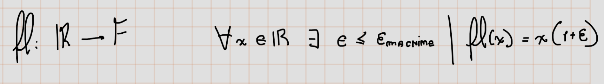

# Lecture 13. Floating Point Arithmetic
- It did not take long after the invention of computers for consensus to emerge on the right way to represent real numbers on a digital machine.
- The secret is floating point arithmetic, the hardware analogue of scientific notation
## Limitations of Digital Representations
- `Computers` use a `finite number of bits` to `represent` a real `number`, so they can `only represent` a `finite subset` of the real `numbers`
- This `limitation` represents `two problems`:
    - The `represented numbers` `cannot` be `arbitrarily` `large` or `small`.
    - There must be `gaps` `between` them.
- Moderns computers represents numbers sufficiently large and small:
    - `IEE:` from $2.23$ X $10^{-308}$ to  $1.79$ X $10^{308}$   
- Gaps between represented numbers:
    - `IEEE` double precision:
        - the interval [1, 2] is represented by the discrete subset:
**$$
1, \quad 1 + 2^{-52}, \quad 1 + 2 \times 2^{-52}, \quad 1 + 3 \times 2^{-52}, \quad \ldots, \quad 2.
  $$**
        - To represent the interval [$2^j, 2^{j+1}$] we multiply the subset by $2^j$
## Floating Point Numbers

- **$F:$**
**$$
x = \pm \left( \frac{m}{\beta^t} \right) \beta^e,
  $$**
    - **$t$** is the **precision** (``24`` for ``single`` precision and ``53`` for ``double precision`` in IEEE)
- A sequência de números é determinada por **$m$**, a `mantissa`
- **$\Delta = \beta^{e-t}$**
## Machine Epsilon
- This number can be defined by
**$$
\epsilon_{machine} = 
\frac{1}{2}\beta ^{1-t}
  $$**
- This number is half the distance between 1 and the next larger floating point number. In other words, this is as large as the gaps between point numbers get:
 - 
 

 ## Floating Point Arithmetic 
- For all \( x, y \in \mathbb{F} \), there exists \( \epsilon \) with \( |\epsilon| \leq \epsilon_{\text{machine}} \) such that

    **$$
x \odot y = (x * y)(1 + \epsilon).
      $$**
- In other words, every operating of floating point arithmetic is exat up to a relative error of site at most **$e_{machine}$**

# Lecture 14. Stability

## Propriedades do \( O(\epsilon_{\text{machine}}) \)

### Soma de termos
Se **\( a = O(\epsilon_{\text{machine}}) \)** e **\( b = O(\epsilon_{\text{machine}}) \)**:

**\[
a + b = O(\epsilon_{\text{machine}})
\]**

*A constante pode mudar, mas a ordem continua a mesma.*

---

### Multiplicação por constante
Para qualquer constante real **\( c \)**:

**\[
c \cdot O(\epsilon_{\text{machine}}) = O(\epsilon_{\text{machine}})
\]**

*O **\( O \)**-grande ignora multiplicadores fixos.*

---

### Multiplicação entre termos
Se **\( a = O(\epsilon_{\text{machine}}) \)** e **\( b = O(\epsilon_{\text{machine}}) \)**:

**\[
a \cdot b = O(\epsilon_{\text{machine}}^2)
\]**

*Multiplicar dois erros pequenos gera um erro de ordem ainda menor.*

---

###  Inverso aproximado
Se **\( 1 + a \)** com **\( a = O(\epsilon_{\text{machine}}) \)** e **\( |a| < 1 \)**:

**\[
(1 + a)^{-1} = 1 + O(\epsilon_{\text{machine}})
\]**

*O inverso de um número próximo de 1 continua próximo de 1, com erro da mesma ordem.*

---

###  Produto com números exatos
Se **\( c \)** é exato (não afetado por erro de máquina) e **\( a = O(\epsilon_{\text{machine}}) \)**:

**\[
c \cdot a = O(\epsilon_{\text{machine}})
\]**

---

###  Negação
Se **\( a = O(\epsilon_{\text{machine}}) \)**, então:

**\[
-a = O(\epsilon_{\text{machine}})
\]**

*Trocar sinal não muda a ordem.*

---

###  Subtração de termos
Se **\( a = O(\epsilon_{\text{machine}}) \)** e **\( b = O(\epsilon_{\text{machine}}) \)**:

**\[
a - b = O(\epsilon_{\text{machine}})
\]**

---

### Resumo geral:

- **Constantes multiplicam, não mudam a ordem.**
- **Somar ou subtrair não altera a ordem.**
- **Multiplicar dois \( O(\epsilon_{\text{machine}}) \) dá \( O(\epsilon_{\text{machine}}^2) \).**
- **Inverso de \( 1 + O(\epsilon_{\text{machine}}) \) é \( 1 + O(\epsilon_{\text{machine}}) \).**

##  Estabilidade Numérica e Backward Stability

###  Estabilidade Numérica

Em algoritmos numéricos, **estabilidade** mede como os **erros de arredondamento e perturbações** no input afetam o resultado final.

Um algoritmo é considerado **estável** se:

- os erros causados por operações numéricas **não crescem descontroladamente**;
- o resultado final é **próximo do valor exato** que seria obtido com precisão infinita.

---

###  Backward Stability (Estabilidade Reversa)

Um algoritmo é **backward stable** se:

- O resultado final **é a solução exata de um problema levemente perturbado**.

Formalmente:  
Se você chama o algoritmo de \( f \), então o algoritmo calcula \( \hat{y} \) tal que:

\[
\hat{y} = f(\hat{x})
\]

onde \( \hat{x} \) é um dado de entrada **ligeiramente diferente** de \( x \) (o dado real) e \( |\hat{x} - x| \approx O(\epsilon_{\text{machine}}) \).

---

####  Intuição:
- O algoritmo com **backward stability** resolve **exatamente** um problema **levemente modificado**.
- Isso é considerado o "padrão-ouro" de estabilidade, porque em vez de controlar o erro de saída, você controla o erro no problema resolvido.

---

###  Comparação Rápida:

| Conceito            | O que significa?                                               |
|----------------------|----------------------------------------------------------------|
| Estabilidade         | O algoritmo **não amplifica muito** os erros de entrada ou arredondamento. |
| Backward Stable      | O algoritmo calcula a **solução exata** de um problema **perturbado** — com erro da ordem \( O(\epsilon_{\text{machine}}) \). |

---

###  Exemplo Clássico:
A resolução de sistemas lineares \( Ax = b \) por eliminação de Gauss com pivotamento parcial é **backward stable**.

Isso quer dizer que o vetor solução \( \hat{x} \) obtido é **exatamente** a solução de:

**\[
(A + \delta A) x = b
\]**

com **\( \|\delta A\| = O(\epsilon_{\text{machine}}) \|A\| \)**.

---

