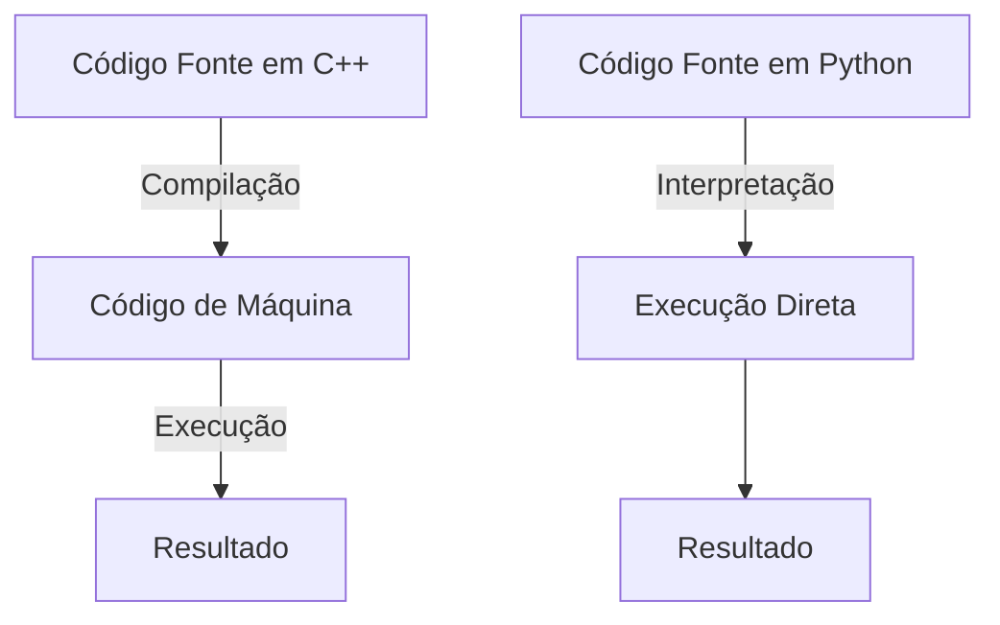

# Semana 1
## Primeiro Programa
### Compilação vs. Interpretação
- **C++** é **compilado:** **precisa** ser **convertido** em um **executável** antes de rodar
- **Python** é **interpretado:** o código é **executado** **linha por linha**
#### Processo de Compilação vs. Interpretação
- Em uma linguagem compilada como C++, o código fonte passa por várias etapas antes de ser executado.
- Em Python, o código é traduzido e executado diretamente pelo interpretador, linha por linha

### Etapas da Compilação
- 1. **Pré-processamento:** O compilador processa diretivas como ``#include``
- 2. **Compilação:** O código-fonte é transformado em código de máquina
- 3. **Ligação (Linking):** As bibliotecas são adicionadas ao programa final
- 4. **Geração do executável:** Um arquivo pronto para rodar é criado
## Tipos Primitivos
- **Definição:** ato de reservar um espaço na memória para a variável (não é atribuído um valor para ela ainda)
- **Atribuição:** quando associamos um valor a esse espaço de memória
- **Inicialização:** Quando ambos são realizados ao mesmo tempo

### Endereçamento
- Cada variável na memória possui um endereço, que pode ser acessado utilizando o operador `&`

### Palavra-chave `const`
- A palavra- chave `const` em C++ serve para **definir** **variáveis** que **não** **podem** ser **modificadas** após a inicialização.
### Palavra-chave `unsigned`
- A palavra `unsigned` em C++ é usada para indicar que um número inteiro não pode ter valores negativos

### Conversão Explícita
- Para evitar ambiguidades. Podemos utilizar o `static_cast<int>(float);` 

